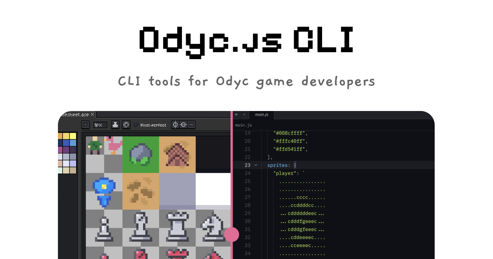

# Odyc CLI

[](https://github.com/meldiron/odyc-cli/actions/workflows/formatter.yml)
[](https://github.com/meldiron/odyc-cli/actions/workflows/linter.yml)
[](https://github.com/meldiron/odyc-cli/actions/workflows/tests.yml)
[](https://golang.org/doc/go1.24)
[](LICENSE)

A powerful CLI tool with handy commands for Odyc.js developers. Generate code from sprites and perform various development tasks to make your life with Odyc.js easier.



## ✨ Features

- **Sprite Code Generation**: Convert PNG sprite images into JavaScript configuration files
- **Color Palette Analysis**: Automatically extract and optimize color palettes from sprites
- **Multi-sprite Support**: Process multiple PNG files in a single command
- **Smart Color Indexing**: Efficient color mapping with support for up to 62 unique colors
- **Flexible Output**: Generate JavaScript configuration files with customizable paths
- **Account Authentication**: Sign in securely from the terminal using the OAuth 2.1 device flow
- **Developer-friendly**: Beautiful terminal output with colored logging and progress indicators

## 🚀 Quick Start

### Prerequisites

- Go 1.24 or higher
- PNG sprite images (for sprite generation)

### Installation

#### Using Go Install

```bash
go install github.com/meldiron/odyc-cli@latest
```

### Basic Usage

```bash
# Show help
odyc-cli
odyc-cli --help
```

## 📋 Commands

### `sprites`

Generate JavaScript configuration from sprite PNG files.

```bash
odyc-cli sprites [OPTIONS]
```

**Options:**
- `-a, --assets <path>` - Path to assets directory containing PNG files (required)
- `-o, --output <path>` - Path to output JavaScript file (required)
- `-f, --force` - Overwrite output file if it exists
- `-h, --help` - Show help for sprites command

**Example:**
```bash
odyc-cli sprites --assets ./game-sprites --output ./src/gameConfig.js --force
```

**Generated Output:**
```javascript
var gameConfig = {
    cellWidth: 6,
    cellHeight: 5,
    colors: [
        "#ff0000ff",
        "#00ff00ff",
        "#0000ffff"
    ],
    sprites: {
        "player": `
            ..12..
            .1221.
            122221
            .1221.
            ..12..
        `,
        "enemy": `
            ..13..
            .1331.
            133331
            .1331.
            ..13..
        `
    }
};
```

### `login`

Sign in to your Odyc account using the OAuth 2.1 device authorization flow. The CLI prints a verification URL and a code (and tries to open your browser automatically); confirm the code in your browser to authenticate this device. Credentials are stored locally in your OS config directory (`auth.json`) with owner-only permissions.

```bash
odyc-cli login
```

**Options:**
- `-h, --help` - Show help for login command

### `whoami`

Show the currently signed-in account by fetching details from the OAuth `/userinfo` endpoint. Expired sessions are refreshed automatically when possible.

```bash
odyc-cli whoami
```

**Options:**
- `-h, --help` - Show help for whoami command

### `logout`

Sign out by revoking the current tokens at the authorization server (best effort) and removing the locally stored credentials.

```bash
odyc-cli logout
```

**Options:**
- `-h, --help` - Show help for logout command

## 🏗️ Architecture

### Project Structure

```
odyc-cli/
├── cmd/                  # Commands implementation
├── .github/              # GitHub Actions workflows
└── main.go               # Application entrypoint
```

### Architecture Overview

The CLI is built using the [Cobra](https://github.com/spf13/cobra) framework for command-line interface management and [charmbracelet/log](https://github.com/charmbracelet/log) for beautiful terminal logging.

**Core Components:**
- **Main Entry Point** (`main.go`): Sets up logging styles and executes commands
- **Root Command** (`cmd/root.go`): Defines the base CLI structure and help information  
- **Commands** (`cmd/*.go`): All available commands

## 🛠️ Development

### Prerequisites for Contributors

- Go 1.24 or higher
- golangci-lint (for linting)
- Git

### Getting Started

1. **Fork and Clone**
   ```bash
   git clone https://github.com/YOUR_USERNAME/odyc-cli.git
   cd odyc-cli
   ```

2. **Install Dependencies**
   ```bash
   go mod download
   ```

3. **Build and Run**
   ```bash
   go build -o odyc-cli .
   ./odyc-cli --help
   ```

### Running Tests

```bash
# Build binary
go build -o odyc-cli .

# Run all tests
go test ./...
```

### Code Formatting

We use `go fmt` to ensure consistent code formatting.

```bash
# Format all Go files
go fmt ./...
```

### Code Linter

We use `golangci-lint` for comprehensive code linting.

```bash
# Install golangci-lint (if not already installed)
go install github.com/golangci/golangci-lint/cmd/golangci-lint@latest

# Run linter
golangci-lint run
```

### Continuous Integration

Our CI/CD pipeline includes:

- **Format Check**: Ensures all Go code is properly formatted with `go fmt`
- **Lint Check**: Runs `golangci-lint` to catch potential issues and enforce coding standards
- **Automated Testing**: Runs on every push and pull request to `main` and `develop` branches

## 🤝 Contributing

We welcome contributions! Please see our [Contributing Guide](CONTRIBUTING.md) for details on how to:

- Report bugs and request features
- Submit pull requests
- Follow our coding standards
- Set up your development environment

## 📜 Code of Conduct

This project adheres to a [Code of Conduct](CODE_OF_CONDUCT.md). By participating, you are expected to uphold this code. Please report unacceptable behavior to the project maintainers.

## 📄 License

This project is licensed under the MIT License - see the [LICENSE](LICENSE) file for details.

## 🙏 Acknowledgments

### Core Dependencies
- [Go](https://golang.org/) - The programming language used to build CLI tool
- [Cobra](https://github.com/spf13/cobra) - Powerful CLI framework for Go
- [Charmbracelet Log](https://github.com/charmbracelet/log) - Beautiful structured logging
- [Charmbracelet Lipgloss](https://github.com/charmbracelet/lipgloss) - Style definitions for terminal UIs
- [Testify](https://github.com/stretchr/testify) - Testing toolkit with assertions and mocks
- [golangci-lint](https://golangci-lint.run/) - Comprehensive Go linter

## 📞 Support

If you encounter any issues or have questions:

1. Check the [Issues](https://github.com/meldiron/odyc-cli/issues) page
2. Create a new issue if your problem isn't already reported
3. Follow the issue template to provide necessary details

---

Made with ❤️ for the Odyc.js community